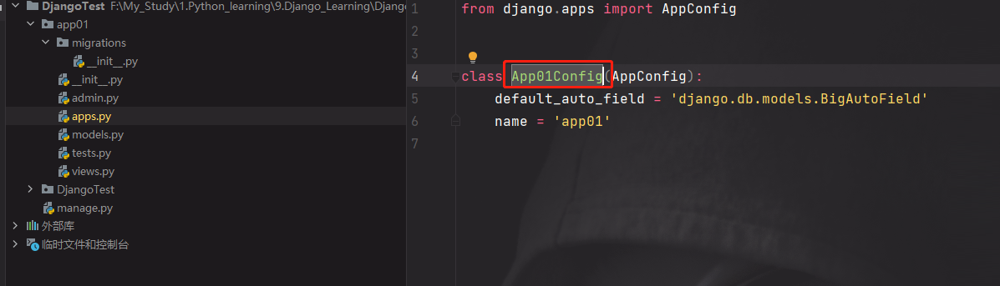
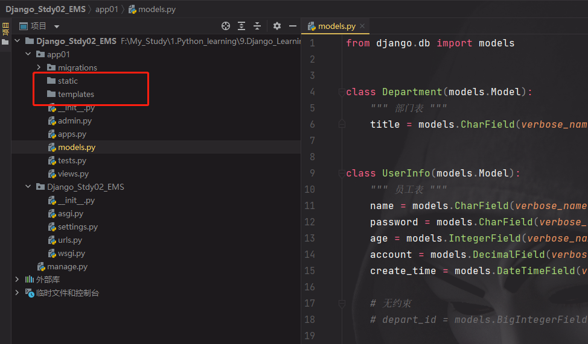

# Django学习笔记_A(DataVisualizationDemo)

## 1.学习问题记录

[Django面试问题【简书】](https://www.jianshu.com/p/3fc79a1e0edb)

[Django简单面试题目【博客园】](https://www.cnblogs.com/zhuizi/p/9571825.html)


#### 1.1 提示页面没有返回值：少写render()，还有记得写上return

#### 1.2 列表页面删除行时，需返回上一页时，考虑通过自定义分页组件余数来实现
#### 1.3 钩子函数，返回值是什么，数据库存入数据就是什么
#### 1.4 做编辑或其他页面，获取对象行数据，**未添加.first()报错**：**'QuerySet' object has no attribute '_meta'！**

```python
row_obj = models.Admin.objects.filter(id=nid).first() ## 结果要么为一个对象，要么为空，没有其他值。
```

#### 1.5 Instence官方说明：从绑定的表单中构造并返回一个模型实例'cleaned_data' ，但不将返回的实例保存到数据库。

 

#### 1.6 创建密码字段render_value=True。

```python
# 外部创建字段
name = forms.CharField(label="用户名", widget=forms.TextInput)  s## 默认记住用户名上次输入不清空
password = forms.CharField(label="用户名", widget=forms.PasswordInput(render_value=True))  ## 设置记住密码上次输入不清空
```

#### 1.7 设置表格字符显示过多时，表格固定，显示不换行，溢出部分显示为“···”的样式方法

```html
<style>
    table{table-layout:fixed;/ *只有定义了表格的布局算法为fixed，下面td的定义才能起作用。* /}
    tbody tr td{width:30em;white-space:nowrap; overflow:hidden; text-overflow:ellipsis;}
</style>
```

#### 1.8 Ajax传送数据是一定要注意路由设置是否正确，否则后端显示正常，前端无反应...
```javascript
$("#forexample2").click(function () {
        $.ajax({
            url: '/task/ajax/',
            type: 'POST',
            data: {
                n1: $("#forexample2").val(),
                n2: $("#forexample3").val(),
            },
            // res为返回的data数据
            dataType:"JSON",
            success: function (res) {
                console.log(res)
                console.log(res.status)
                console.log(res.data)
            }
        })
    })
```

#### 1.9 windows当默认的端口8000被占用时，查看pid方法

```shell
netstat -ano|findstr "8000"
```

#### 1.10 Linux CentOS8下载元数据失败解决方法

```shell
# Centos8.1下载慢，随手百度，方法都是推荐更换国内的yum源。
# 按照推荐的方法，发现总是出现
# 错误：为 repo ‘base’ 下载元数据失败
# 搞了一晚上才发现，源网址都是对应系统版本号的，现在的资料都是针历史版本的。
# 大家可以按照如下流程修改源

# 1.备份现有源
mv /etc/yum.repos.d /etc/yum.repos.d.backup
# 2.设置新的yum目录
mkdir /etc/yum.repos.d
# 3.安装wget（我没安装，也没事，可能是我以前安装过）
yum install -y wget
# 4.就是坑了我一晚上的下载配置(大家一定要区分自己的系统版本，不然肯定不通过)
# CentOS 5
wget -O /etc/yum.repos.d/CentOS-Base.repo http://mirrors.aliyun.com/repo/Centos-5.repo
# CentOS 6
wget -O /etc/yum.repos.d/CentOS-Base.repo http://mirrors.aliyun.com/repo/Centos-6.repo
# CentOS 7
wget -O /etc/yum.repos.d/CentOS-Base.repo http://mirrors.aliyun.com/repo/Centos-7.repo
# CentOS 8
wget -O /etc/yum.repos.d/CentOS-Base.repo http://mirrors.aliyun.com/repo/Centos-8.repo
# 5.清除文件并重建元数据缓存
yum clean all
yum makecache
6.最后更新软件包，这一步要下载安扎ung或升级一百多个软件包，比较费时间，大概三五分钟吧！
yum update -y
```

#### 1.11 配置Typora编辑器width

```css
#typora-source .CodeMirror-lines {
  max-width: 60%;
  padding-left: 70px;
  padding-right: 70px;
}

#write {
  display: block !important;
  visibility: visible;
  opacity: 1;
  transition: 0.3s;
  max-width: 95%;
  padding-left: 70px;
  padding-right: 70px;
}
```

#### 1.12 jinjia2模板语言：html模板中for循环

```jinja2
##  x2 = [28, "单身", "管理员"]   列表用法

	<li>{{ item }}</li>\


##  x2 = ["name":”韩超", "salary":12000]   字典用法

	<li>{{ item }}</li>\

```

#### 1.13 html前端form表单务必记得增加csrf_token的安全校验

```html
<!-- HTML中form表单需要注意使用csrf_token的校验，否则会提示错误 --> 
<form id="loginForm">
    
    ... ...
</form>
```

#### 1.14 重定向与跳转的区别

**重定向：**首先服务器受到浏览器客户端请求之后，服务器发送新的链接到客户端浏览器，浏览器接收到新的链接之后又重新请求收到的链接地址，在整个过程中完成之后在客户端浏览器看来是发生了一次跳转，其实是客户端浏览器请求了两次而已，所以在浏览器的地址栏里网络地址自然就会改变成新的连接；学习过某个老师说的是，重定向是服务器自己内部跳转

**转发：**服务器 接收到客户端的请求之后，服务器把控制权交到另一个JSP页面手里，新的JSP页面接收到请求之后根据情况是继续转交控制权或者显示页面由自己决定，到最后显示页面的整个过程就是一个页面跳转过程，在这个过程中，服务器可以把请求的数据在经过的页面进行传递，而不会担心数据的丢失。

**两者的区别：**

1.请求的次数的不同，重定向总共请求了两次服务器；转发则是用户请求一次可能经过N个JSP页面由返回到用户浏览器中，是一次请求多次处理的过程；

2.跳转过程中链接的变化，重定向在跳转中请求了两次服务器并且是两次不同的链接地址，在浏览器的地址栏可以看到两次是有变化的；转发在跳转过程中浏览器请求了一次服务器，服务器经过了n个JSP页面并没有改变请求的链接地址，因为用户只请求了一次，所以在整个跳转过程中链接地址是没有改变的，在浏览器的地址栏就可以看到。

3.目的不同，重定向只是简单的让用户访问一个新的链接，而转发是服务器要得到用户的请求内容并需要进行一部分处理的，所以两者目的之不同的。

#### 1.15 Django数据类型QuerySet的理解（可以直接转dataframe对象）

```reStructuredText
## queryset = models.UserInfo.objects.all().values()方法的结果
<QuerySet 
[
{'id': 1, 'name': 'test1', 'password': 'test1', 'age': 26, 'account': Decimal('77664.59'), 'create_time': datetime.date(2021, 3, 18), 'gender': 1, 'depart_id': 27},
{'id': 2, 'name': 'test2', 'password': 'test2', 'age': 48, 'account': Decimal('97761.22'), 'create_time': datetime.date(2021, 9, 30), 'gender': 1, 'depart_id': 37}, 
{'id': 3, 'name': 'test3', 'password': 'test3', 'age': 30, 'account': Decimal('27375.30'), 'create_time': datetime.date(2022, 2, 15), 'gender': 1, 'depart_id': 37},
{'id': 4, 'name': 'test4', 'password': 'test4', 'age': 29, 'account': Decimal('56573.97'), 'create_time': datetime.date(2021, 9, 23), 'gender': 1, 'depart_id': 37},
]
 >

## queryset = models.UserInfo.objects.all().values_list()方法的结果
<QuerySet 
[
(1, 'test1', 'test1', 26, Decimal('77664.59'), datetime.date(2021, 3, 18), 1, 27), 
(2, 'test2', 'test2', 48, Decimal('97761.22'), datetime.date(2021, 9, 30), 1, 37), 
(3, 'test3', 'test3', 30, Decimal('27375.30'), datetime.date(2022, 2, 15), 1, 37), 
(4, 'test4', 'test4', 29, Decimal('56573.97'), datetime.date(2021, 9, 23), 1, 37), 
(5, 'test5', 'test5', 44, Decimal('21621.78'), datetime.date(2021, 7, 1), 1, 27), 
]
 >
```


## 2.搭建环境步骤

### 2.1 学习Django的知识方向及其特点

```reStructuredText
python知识点：函数、面向对象；
前端开发：HTML、CSS、js、jQuery、BootStrap；
数据库：mysql；
python的web框架：
flask：自身短小精悍 + 第三方组件
Django：内部集成很多组件 + 第三方组件
```

### 2.2 Django安装及文件组织结构

安装Django

```shell
pip install django
```

python文件结构：

```res
F:\Anaconda

    -python.exe

    -Script\   （管理工具）

        -pip.exe

        -django-admin.exe

    -Lib\   （第三方包存储位置）

        -内置模块

    -site-packages\

        -openxl

        -flask

        -django

        -pandas

    ...
```

### 2.3 命令创建Django项目

```shell
cd F:\My_Study\1.Python_learning\9.Django_Learning

django-admin startproject Django_Learning
```

### 2.4 Pycharm创建Django项目

 


**settings.py清空'DIRS': []列表，且删除\templates目录，按标准创建**: 


**项目文件介绍：**

```res
DjangoTest\

	-manage.py 【项目管理、启动项目、APP创建、数据管理】 勿动文件  经常使用

	-DjangoTest\

        -__init__.py

        -settings.py【项目配置文件  经常更改】

        -urls.py【url和函数的对应关系  经常更改】

        -asgi.py【接收网络请求】勿动文件  异步方式 Django3不成熟

        -wsgi.py【接收网络请求】勿动文件  同步方式 成熟
```


## 3.APP的创建与说明

### 3.1 大型网站往往可以包含多个APP

```reStructuredText
APP   用户管理【表结构、函数、HTML模板、CSS】

APP   订单管理【表结构、函数、HTML模板、CSS】

APP   后台管理【表结构、函数、HTML模板、CSS】

APP   网站【表结构、函数、HTML模板、CSS】

APP   API【表结构、函数、HTML模板、CSS】

...
```


**一般我们开发一个网站包含一个APP、项目下创建一个APP即可。Pycharm进入终端输入创建APP：**

```shell
python manage.py startapp app01
```


**APP目录下的文件说明：**

```RES
app01\

	-migrations【 固定勿动】对数据库字段变动做记录

	-__init__.py

    -admin.py【 固定勿动】django默认提供了后台管理

    -apps.py【固定勿动】app启动类

    -models.py【数据库操作 经常修改】

    -testspy【 固定勿动】用于单元测试

    -views.py【函数 经常修改】
```


## 4.快速上手练习

### 4.1 确保注册（settings）

 

 


### 4.2 编写url与视图函数的对应关系【urls】

 


### 4.3 编写视图函数【views..py】

 


### 4.4 运行方式

**终端命令运行：**

```shell
python manage.py runserver
```

**pycharm运行**

访问127.0.0.8000不能到达，需要访问127.0.0.8000/index/


### 4.5 render函数

**当settings文件设置'DIRS': [BASE_DIR / 'templates'],**

**寻找html文件时，优先寻找项目根目录下templates是否存在html文件，若没有，则根据app注册顺序，逐一在每个app目录下的templates继续寻找。**

 


### 4.6 静态文件

图片、js、css 等视作静态文件（static files）

**Django中 static目录放置及引用：**

 


**建议每个HTML文件在引用静态文件时加上引用：**  

```
   
```

且文件路径可以附带，到时候更改文件夹名称就很方便！ “%” 与 “{” 和 “}” 之间不允许空格


**与setting里面的static对应，方便文件修改。**

 


## 5.Django模板语法（jinjia2模板语法）

**本质上为：在HTML写入占位符，用python实现替换及处理。**

视图函数中，views.py文件中函数写法：

```python
def tpl(request):
    name = "韩超"
    info = [28, "单身", "管理员"]
    ## 获取变量引入html页面
    return render(request, "tpl.html", {"x1": name, "x2": info})
```


**在html文件中变量引用写法：**

```jinja2
引用变量格式：{{ x }}

书写语句格式：
```


**前端登录界面使用后端变量：**

```django
<!DOCTYPE html>
<html lang="en">
<head>
    <meta charset="UTF-8">
    <title>Title</title>
</head>
<body>
<h1>模板语法的学习--tpl函数页面</h1>
<hr>
<h2>views里边对应函数的变量引用</h2>
<h2>变量引用</h2>
<div>{{ x1 }}</div>
<div>{{ x2 }}</div>
<hr>
<h2>列表变量的元素引用</h2>
<div>{{ x2.0 }}</div>
<div>{{ x2.1 }}</div>
<div>{{ x2.2 }}</div>
<hr>
<h2>循环实现列表变量的元素引用</h2>
<ul>
    
    <li>{{ item }}</li>\
    
</ul>
</body>
</html>
```


## 6.请求和响应

 

### 6.1 案例：用户登录

结合bootstrap框架做的登陆界面login.html页面，中文官网：[www.bootcss.com](https://www.bootcss.com/)

```django
<!DOCTYPE html>
<html lang="en">
<head>
    <meta charset="UTF-8">
    <title>用户登录</title>
    <link rel="stylesheet" href="../static/bootstrap/css/signin.css">
    <link rel="stylesheet" href="../static/bootstrap/css/bootstrap.min.css">
</head>
<body>
<div class="container">

    <form class="form-signin" method="post">
        
        <h2 class="form-signin-heading text-center">账号密码登录</h2>
        <label for="inputEmail" class="sr-only">Email address</label>
        <input type="email" id="inputEmail" class="form-control" placeholder="邮箱" required autofocus name="user">
        <label for="inputPassword" class="sr-only">Password</label>
        <input type="password" id="inputPassword" class="form-control" placeholder="密码" required name="pwd">
        <div class="checkbox">
            <label>
                <input type="checkbox" value="remember-me"> 记住密码
            </label>
        </div>
        <button class="btn btn-lg btn-primary btn-block" type="submit">登录</button>
        <h4 class="form-signin-heading text-center">{{ error_msg }}</h4>
    </form>
</div> <!-- /container -->

</body>
</html>
```


**根据之前的配置将下载的文件改名：bootstrap，放入static文件夹下**

 

**前端效果：**

 


## 5.Django的mysql数据库操作

### 5.1 Django对mysql操作，实质依赖于pymysql，所以一般最好将其一起安装

```
pip install pymysql
pip install mysqlclient
```


### 5.2 mysql创建数据库SQL语句

```sql
/* 格式 */  
create database [if not exists] db_name [default] character set [=] charset_name;

/* 附带校验格式写法（推荐）*/  
create database db_name default charset utf8 collate utf8_general_ci;

/* 实例 */
create database gx_day16 default charset utf8 collate utf8_general_ci;
```


### 5.3 pymysql操作数据库【Django不使用该方法，而是使用ORM框架】

```python
## pymysql连接mysql
conn = pymysql.connect(host="192.168.127.100",
                       port=3306,
                       user="root",
                       passwd="Cc158854@",
                       charset="utf8",
                       db="unicom")
## 游标数据获取
cursor = conn.cursor(cursor=pymysql.cursors.DictCursor)
```


### 5.4 Django ORM框架操作数据库

 


**ORM不能实现数据库直接操作,比如创建数据库，删除数据库，这都是不可行的；**

**ORM只能对数据库中的表进行操作：创建、修改、删除等；**

**ORM操作数据库时，不用写sql语句，直接使用ORM框架代码实现即可。**


#### 5.4.1 SQL语句创建数据库

我已搭建在虚拟机192.168.127.xxx上；先进行更新CENTOS8发现错误：

Cannot prepare internal mirrorlist: No URLs in mirrorlist

**在CentOS 8中，使用yum时出现错误，镜像列表中没有url**，类似如下:

Error: Failed to download metadata for repo 'appstream': Cannot prepare internal mirrorlist: No URLs in mirrorlist

**原因：在2022年1月31日，CentOS团队终于从官方镜像中移除CentOS 8的所有包。**

CentOS 8已于2021年12月31日寿终正非，但软件包仍在官方镜像上保留了一段时间。现在他们被转移到https://vault.centos.org

**解决方法：**如果你仍然需要运行CentOS 8，你可以在/etc/yum.repos.d中更新一下源。使用vault.centos.org代替mirror.centos.org。

```
$ sudo sed -i -e "s|mirrorlist=|##mirrorlist=|g" /etc/yum.repos.d/CentOS-*
$ sudo sed -i -e "s|##baseurl=http://mirror.centos.org|baseurl=http://vault.centos.org|g" /etc/yum.repos.d/CentOS-*
```

**mysql创建数据库**

```
create database gx_day15 default charset utf8 collate utf8_general_ci;
```

#### 5.4.2 ORM连接数据库并创建表

**settings.py文件中配置DATABASES修改为（该配置一般属于隐私项，一般配置于local_settings.py**）：

```
DATABASES = {
    'default': {
        'ENGINE': 'django.db.backends.mysql',  ## 引擎选择 此处为mysql对应的引擎
        'NAME': 'gx_day15',  ## 数据库名称
        'USER': 'root',  ## 数据库用户名
        'PASSWORD': 'Ccxxxxx',  ## 数据库密码
        'HOST': '192.168.127.xxx',  ## ip地址
        'PORT': '3306',  ## 端口号
    }
}
```

 


**ORM利用文件modle.py文件配置创建数据库表：**

```
from django.db import models


## 创建类实现创建数据库的表
class UserInfo(models.Model):
    name = models.CharField(max_length=32)  ## 字符串类型
    password = models.CharField(max_length=64)   ## 字符串类型
    age = models.IntegerField()  ## 整数型

'''
上面的类等价于写创建表的SQL语句：
create table app01_UserInfo(
    id bigint auto_increment primany key,  （默认添加到创建的表）
    name varchar(32),
    password varchar(64),
    age int,
)
'''
```


**确保app已经注册之后，终端中进入 manage.py 所在目录使用命令提交创建表的语句数据：**

```
python magage.py makemigrations  app01

python magage.py migrate app01
```


**查看gx_day15数据库的表，其中创建的数据表命名格式 “app名称_models.py定义的类名”：**

 


#### 5.4.3 ORM 添加数据库和修改表结构

**直接注释，再次提交命令就可以实现表的添加与删除**

 


**注释后提交数据库结构【2个注释的数据库被删除】：**


表内结构【age已经删除】：

 


**注意：数据库的表在添加数据时，需要设置默认值或者为空**

一、执行命令时提示：选择1则手动输入一个值；

二、设置默认值（可设置为空）；

```python
data = models.IntegerField(default=2)  ## 假设为已有前面数据，新要添加的数据必须设置默认值

score = models.IntegerField(null=True,blank=True)  ## 设置默认值为空
```


#### 5.4.4 ORM 表内数据增删改查

views.py导入models.py中的类，使用类的封装方法添加数据到数据库表中：

models.py

```python
##models.py中的代码
from django.db import models


## 创建类实现创建数据库的表
class UserInfo(models.Model):
    name = models.CharField(max_length=32)  ## 字符串类型
    password = models.CharField(max_length=64)  ## 字符串类型
    age = models.IntegerField(default=25)  ## 整数型
    ## data = models.IntegerField(default=2)  ## 假设为已有前面数据，新要添加的数据必须设置默认值
    ## score = models.IntegerField(null=True,blank=True)  ## 设置默认值为空

    '''
    上面的类等价于写创建表的SQL语句：
    create table app01_UserInfo(
        id bigint auto_increment primany key,  （默认添加到创建的表）
        name varchar(32),
        password varchar(64),
        age int,
    )
    '''

class Department(models.Model):
    title = models.CharField(max_length=16)

## 新建数据方式
## SQL语句写法  insert into app01_Department(title)values("销售部");
## ORM方式  Department.objects.create(title = "销售部")
## 一般ORM方式写入数据不在此处，在veiws.py文件中，先导入此处的类。
```


views.py

```python
##views.py中的代码
from app01.models import UserInfo, Department


def orm(request):
    ## 测试ORM方式
    UserInfo.objects.create(name="岑鸿昌", password="cc158854", age="27")
    UserInfo.objects.create(name="吴佩琦", password="12345678")
    Department.objects.create(title="销售部")
    Department.objects.create(title="网络部")
    Department.objects.create(title="IT部")

    return HttpResponse("数据操作成功！")
```


**运行页面，查询数据库数据已添加成功：**

 

注意：每次进入页面都会运行一次，手动添加请记得注释！


### 5.5 视图函数（view.py）中应用增删改查

```python
## 测试ORM方式 注意使用时每次进入页面就会执行一次
## 1 增加数据
UserInfo.objects.create(name="岑鸿昌", password="cc158854", age="27")
UserInfo.objects.create(name="吴佩琦", password="12345678")
Department.objects.create(title="销售部")
Department.objects.create(title="网络部")
Department.objects.create(title="IT部")

## 2 删除数据
## 2.1 以id删除;  filter表示筛选
UserInfo.objects.filter(id=2).delete()
Department.objects.filter(id=6).delete()
## 2.2 删除表全部数据
UserInfo.objects.all().delete()
Department.objects.all().delete()

## 3 获取数据
## 3.1 获取全部数据
data_list = UserInfo.objects.all()  ## 获取QuerySet类型数据[行1, 行2, 行3]，可以按照列表处理。
for obj in data_list:
    print(obj.id, obj.name, obj.password, obj.age)

## 3.2 以id获取数据
data_list = UserInfo.objects.filter(id=1)  ## 获取QuerySet类型数据[行1,]，仍然是列表。
row_obj = data_list.first()  ## 取出列表中存储的第一个对象的方法
print(row_obj.id, row_obj.name, row_obj.password, row_obj.age)

## 4 更新数据
## 4.1 全部更新
UserInfo.objects.all().update(password="12345")
## 4.2 部分更新
UserInfo.objects.filter(id=1).update(password="cc123")
UserInfo.objects.filter(name="吴佩琦").update(age="30")
```


## 6.用户管理案例应用

### 思路及要求

#### 6.1 展示用户列表

```python
- url

- 函数:

	- 获取所有的用户信息

	- 嵌套HTML渲染
```


#### 6.2 实现添加用户

```python
- url

- 函数:

	GET请求，看到页面，输入内容
	POST请求，提交数据，写入到数据库
```


#### 6.3 实现删除用户

- url
- 函数

```
## 假设实现传入一个nid值，GET请求
http://127.0.0.1:8000/info/delete/?nid=1
http://127.0.0.1:8000/info/delete/?nid=2
http://127.0.0.1:8000/info/delete/?nid=3

def info_delete(request):
    nid = request.GET.get("nid")
    UserInfo.objects.filter(id=nid).delete()
    return redirect("/info/list/")  ## 重定向至本页
```


用户列表显示时直接创建删除(绑定url)

**GET请求HTML端写法：**

```python
<a href="/info/delete?nid={{ obj.id }}">删除</a>
```


 


注意：setting.py此处(**DEBUG=True**)需要**修改为False**,否则会报错404

DEBUG = False   ## 默认值为Ture, 使得以GET请求删除数据库受阻！

 


## 7.联通员工管理系统案例

#### 7.1 创建项目并修改DIRS

 


#### 7.2 创建app并注册

公司开发一般取名web site或者什么，此处我们还是叫**app01**

 

 


#### 7.3 表结构设计

**部门表：**

| id   | title |
| ---- | ----- |
| 1    | 销售  |
| 2    | 客服  |
| 3    | 运维  |

**员工表：**

| id   | name   | password | age  | account | create_time | 部门名称/部门ID |
| ---- | ------ | -------- | ---- | ------- | ----------- | --------------- |
| 1    | 诸葛亮 | ap123    | 31   | 100000  | 2022-03-02  | 1               |
| 2    | 张良   | ap111    | 32   | 110000  | 2022-03-02  | 3               |
| 3    | 王昭君 | ap222    | 33   | 120000  | 2022-03-02  | 2               |


**1.表关联列部门名称/部门ID一般存储什么呢？**

答：一般使用部门id存储，节省存储的开销，但是查询就需要联表查询。

而特别大的公司，对于经常使用到查询部门名称的就会选择直接存储部门名称，方便查询。


**2.此处我们选择用部门ID，部门ID需不需要约束？**

答：需要，只能使用部门表中已经存在的ID


**3.假设某些部门被删除，关联的用户怎么处理？**

答：级联删除或置空。


**所以最后设计为：**

| id   | name   | password | age  | account | create_time | depart_id |
| ---- | ------ | -------- | ---- | ------- | ----------- | --------- |
| 1    | 诸葛亮 | ap123    | 31   | 100000  | 2022-03-02  | 1         |
| 2    | 张良   | ap111    | 32   | 110000  | 2022-03-02  | 3         |
| 3    | 王昭君 | ap222    | 33   | 120000  | 2022-03-02  | 2         |


紧接着，再增加性别列，0为女，1为男，表为：

| id   | name   | password | age  | account | create_time | depart_id | gender |
| ---- | ------ | -------- | ---- | ------- | ----------- | --------- | ------ |
| 1    | 诸葛亮 | ap123    | 31   | 100000  | 2022-03-02  | 1         | 1      |
| 2    | 张良   | ap111    | 32   | 110000  | 2022-03-02  | 3         | 1      |
| 3    | 王昭君 | ap222    | 33   | 120000  | 2022-03-02  | 2         | 0      |


```python
## 数据固定选择写法
gender_choices = ((0, "女"),(1, "男"))
gender = models.SmallIntegerField(verbose_name="性别", choices=gender_choices)
```


**最后表设计ORM将要执行的代码models.py为：**

```python
from django.db import models


class Department(models.Model):
    """ 部门表 """
    title = models.CharField(verbose_name="标题", max_length=32)


class UserInfo(models.Model):
    """ 员工表 """
    name = models.CharField(verbose_name="姓名", max_length=16)
    password = models.CharField(verbose_name="密码", max_length=64)
    age = models.IntegerField(verbose_name="年龄")
    account = models.DecimalField(verbose_name="账户余额", max_digits=10, decimal_places=2, default=0)  ## 最大长度10，2位小数，默认值0
    create_time = models.DateTimeField(verbose_name="入职时间")

    ## 无约束
    ## depart_id = models.BigIntegerField(verbose_name="部门ID")

    ## 有约束
    ##  1.参数
    ##   to="关联表名"
    ##   to_field="关联表的列名"
    ##  2.Django自动处理列名
    ##   depart会自动改为depart_id
    ## depart = models.ForeignKey(to="Department", to_field="id")
    ##  3.假设某个部门被删除，那在员工表中对应被删除部门的员工数据如何处理？
    ##   3.1 级联删除处理
    ## depart = models.ForeignKey(to="Department", to_field="id", on_delete=models.CASCADE)
    ##   3.2 置空处理
    depart = models.ForeignKey(to="Department", to_field="id", null=True, blank=True, on_delete=models.SET_NULL)

    ## 数据固定选择写法
    gender_choices = (
        (0, "女"),
        (1, "男")
    )
    gender = models.SmallIntegerField(verbose_name="性别", choices=gender_choices)
```


#### 7.4 创建数据库及创建表

**创建数据库gx_day16**

```sql
CREATE DATABASE gx_day16 DEFAULT CHARSET utf8 COLLATE utf8_general_ci;
```


**settings.py配置连接数据库**

```python
DATABASES = {
    'default': {
        'ENGINE': 'django.db.backends.mysql',  ## 引擎选择 此处为mysql对应的引擎
        'NAME': 'gx_day16',  ## 数据库名称
        'USER': 'root',  ## 数据库用户名
        'PASSWORD': 'Cc158854@',  ## 数据库密码
        'HOST': '192.168.127.100',  ## ip地址
        'PORT': '3306',  ## 端口号
    }
}
```


**生成表**：Pycharm运行manage.py任务工具【ctrl+alt+r】:

```shell
makemigrations app01
migrate
```


#### 7.5 文件目录结构管理

 


#### 7.6 部门管理模块

**方法一：原始方法，代码复杂。**

**方法二：Django方法，Form和ModelForm组件，代码简单。**


我们先学习原始方法，了解真正的实现过程。


###### **7.6.1 部门列表**

 

**注意点：**

1. bootstrap组件的使用方法：官网复制代码

 

 


**bootstrap导航使用：复制代码改造**

 


**记住在form表单添加：**


###### 7.6.2 添加部门

 


注意点：实现不能为空及已存在值验证（后端），该方法其实可以不用考虑，因为前端组件可以做此类判断。

 


###### 7.6.3 删除部门

 

 


###### 7.6.4 编辑部门

**实现思想：**

```reStructuredText
在view.py设置修改函数，使用正则表达式判断int类型nid，并作为参数传递给函数。
点击编辑按钮，跳转至编辑页面，输入框设置默认值刚好是传递进来id所对应的title。
```


**代码实现：**

 

 

 

 


#### 7.7 jinjia2模板语言-模板继承extends

**定义模板：**

```html

<!DOCTYPE html>
<html lang="en">
<head>
    <meta charset="UTF-8">
    <title>Title</title>
    <!-- 使用X-UA-Compatible设置IE兼容模式 最新渲染模式 -->
    <meta http-equiv="X-UA-Compatible" content="IE=edge">
    <meta name="viewport" content="width=device-width, initial-scale=1"/>
    <link rel="stylesheet" href="">
    <style>
        .navbar {
            border-radius: 0; /* 去除圆角 */
        }
    </style>
    
</head>
<body>
    <div class="container">
        
    </div>
</body>
<!-- 如果使用插件，必须引入jQuery -->
<script type="text/javascript" src=""></script>
<!-- 包括所有的bootstrap的js插件或者可以根据需要调用js插件调用 -->
<script type="text/javascript" src=""></script>

</html>
```


继承模板：

```django



    <!-- 非继承content代码区 -->

```


#### 7.8 用户管理模块

继续原始方法实现，代码复杂，先使用mysql添加用户：

字段：name,password,age,account,create_time,gender,depart_id

```sql
INSERT INTO app01_userinfo(NAME,PASSWORD,age,account,create_time,gender,depart_id) VALUES("刘备","lb123",24,1200.07,"2021-01-20",1,1);
INSERT INTO app01_userinfo(NAME,PASSWORD,age,account,create_time,gender,depart_id) VALUES("关羽","hc123",24,1200.07,"2021-01-20",1,2);
INSERT INTO app01_userinfo(NAME,PASSWORD,age,account,create_time,gender,depart_id) VALUES("张飞","zf123",24,1200.07,"2021-01-20",1,3);
```

 


###### 7.8.1 部门列表

使用之前的部门列表改造；值得注意的是数据的类型及创建表的数据变量引用问题！

 


模板语法html中代码：

```jinjia2
时间变量：obj.create_time|date:"Y-m-d"
针对choice类型的字段，隐藏数字显示，调用显示中文方法：obj.get_gender_display  
```


###### 7.8.2 添加用户

涉及性别选择和部门选择：使用循环及面向对象编程思想，获取元组对象及已存在部门对象，从中循环，即可显示。

 


性别：

 


部门：

 


###### 7.8.3 删除用户

 

 


###### 7.8.4 编辑用户

 


###### 7.8.5 Form/ModelForm组件实现-添加用户

- 原始方式理思路: 不会采用(本质)【麻烦】

```
1、用户提交数据没有校验。
2、错误,页面上应该有错误提示。
3、页面上,没一个字段都需要我们重新写一遍。
4、关联的数据,手动去获取并展示循环展示在页面。
```


以上方式不能在企业开发中使用，因为繁琐，工作量大！

- Django组件

```
--Form组件：搭配少许代码
--ModelForm组件：搭配更少的代码；可以与model.py里面定义的数据直接联用！
```


**Form组件实现**

views.py中添加类和函数

```python
class MyForm(forms):
    name = forms.CharField(widget=forms.TextInput)
    password = forms.CharField(widget=forms.TextInput)
    age = forms.IntegerField(widget=forms.TextInput)

def user_model_form_add(request):
  
  
def user_model_form_add(request):
    if request.method == "GET":
        form = MyForm()
        return render(request, "user_model_form_add.html", {"form": form})
```

 

user_add.html中for循环表达

```django
<form class="form-signin" method="post">
    
    
        {{ field }}
    
</form>
```


**ModelForm组件实现**

ModelForm组件可以直接对接model.py创建的数据

views.py中添加嵌套类和页面函数

```python
class UserModelForm(forms.ModelForm):
    class Meta:
        model = models.UserInfo
        fields = ["name", "password", "age", "account", "create_time", "gender", "depart"]
        ## 给前端添加样式widgets原理写法【实际开发不使用】
        ## 关键字【有s】：widgets
        ## widgets = {
        ##     "name": forms.TextInput(attrs={"class": "form-control"}),
        ##     "password": forms.PasswordInput(attrs={"class": "form-control"}),
        ##     "age": forms.TextInput(attrs={"class": "form-control"}),
        ## }

    ## 给前端添加样式快速写法,与Meta类同级【工作必须使用】
    def __init__(self, *args, kwargs):  ## 有self，代表本函数内参数传递
        super().__init__(*args, kwargs)  ## 无self，使用父类方法，其实就是使用类Meta的对象
        ## 循环找到所有插件，字典对象
        for name, field in self.fields.items():
            print(name, field)
            field.widget.attrs = {
                "class": "form-control",
                "placeholder": field.label
            }
              
def user_model_form_add(request):
    if request.method == "GET":
        form = UserModelForm()
        return render(request, "user_model_form_add.html", {"form": form})
```


user_add.html中for循环表达

```django
<form class="form-signin" method="post">
    
    
        {{ field.label }}：{{ field }}
    
</form>
```


模型的“__str__”方法，在遇到选择部门选择这种情况：

 原理解析：


```
class ClassName(object):
    """docstring for ClassName"""
    pass
classname = ClassName()
print(classname)

## 输出结果为一个对象
## <__main__.ClassName object at 0x00000243212DE7C0>
## [Finished in 0.1s]
```


Return一个固定值：

```python
class ClassName(object):
    """docstring for ClassName"""
    def __init__(self, arg):
        self.arg = arg
    def __str__(self):
        return “哈哈哈”


classname = ClassName()
print(classname)

## 输出结果
## 哈哈哈 
## [Finished in 0.1s]
```


Return一个实例化值：

```python
class ClassName(object):
    """docstring for ClassName"""
    def __init__(self, arg):
        self.arg = arg
    def __str__(self):
        return self.arg


classname = ClassName("IT部门")
print(classname)

## 输出结果
## IT部门
## [Finished in 0.1s]
```


models.py中争对此情况Django内部封装__str__方法调用即可显示想要的值。

 


实现数据提交：s

```python
def user_model_form_add(request):
    if request.method == "GET":
        form = UserModelForm()
        return render(request, "user_model_form_add.html", {"form": form})

    ## POST请求提交数据，需要进行数据校验
    ## 如果数据合法，则使用save方法保存到数据库;反之提示错误信息
    form = UserModelForm(data=request.POST)
    if form.is_valid():
        form.save()
    else:
        print(form.errors)
```


前台数据浏览器自动校验空值错误，后台处理显示提示：

 


错误为英文显示处理，修改配置文件：setting.py

 


###### 7.8.6 组件实现-编辑用户

从添加用户中，建议使用情景：

```
1、针对数据库的某个表编辑或添加：ModelForm
2、针对不是数据库的情景：Form
```


实现思路：

```
1、点击编辑携带ID跳转页面；
2、实现ID对应数据库中的信息并展示在前端表单；
3、填写数据：
      --数据需要校验，错误有提示；
      --数据提交更新；
4、重定向至用户列表。
```


对于ModelForm,可以继续使用之前创建的类实例化使用即可。

views.py增加函数： data数据更新覆盖实例instance

```python
def user_model_form_edit(request, nid):
    """编辑用户"""

    if request.method == "GET":
        ## instance；实例；使用该参数直接对接数据库行数据即可。
        row_obj = models.UserInfo.objects.filter(id=nid).first()  ## 获取querySet的第一个对象行数据。
        form = UserModelForm(instance=row_obj)
        return render(request, "user_model_form_edit.html", {"form": form})

    row_obj = models.UserInfo.objects.filter(id=nid).first()  ## 获取querySet的第一个对象行数据。
    form = UserModelForm(data=request.POST, instance=row_obj)  ## data数据更新覆盖实例instance。
    if form.is_valid():
        ## 默认保存Meta类里的fields变量参数字段，假设未设置全部字段，此处想增加字段语法如下：
        ## form.instance.字段名 = 值
        form.save()
        return redirect("/user/list/")
    else:
        return render(request, "user_model_form_add.html", {"form": form})
        
```


数据库时间数据类型改为日期数据类型：DateTimeField—>DateField

model.py修改并使用manage.py运行任务工具输入命令：

 


数据迁移命令：

```shell
makemigrations app01
migrate
```


 


###### 7.8.7 组件实现-删除用户

 

 

 


#### 7.9 靓号管理模块

- 编写思路

1. 设计表结构并生成到数据库；
2. 靓号列表页面； 

```
--UR

--表结构：id phonenum price level(中文) status(中文)

--实现添加删除功能

--数据校验：
	a.数据格式校验；
	b.数据重复校验；
	c.数据组合校验等

--实现编辑功能
```


###### 7.9.1 设计表结构

| id | phonenum | price | level | status |
| ------ | ------------ | --------- | --------- | ---------- |
|        |              |           |           |            |
|        |              |           |           |            |


```python
class PrettyNum(models.Model):
    """ 靓号表 """
    phonenum = models.CharField(verbose_name="号码", max_length=11)
    price = models.IntegerField(verbose_name="价格",default=0)

    level_choices = choices = (
        (1, "1级"),
        (2, "2级"),
        (3, "3级"),
        (4, "4级"),
    )
    level = models.SmallIntegerField(verbose_name="级别", choices=level_choices, default=1)

    status_choices = (
        (0, "未使用"),
        (1, "已使用")
    )
    status = models.SmallIntegerField(verbose_name="状态", choices=status_choices, default=0)
```


工具生成数据表：makemigrations app01、migrate

 


mysql假设创建有误，想删除表：

```sql
drop 表名；
```


增加测试数据：

```python
insert into app01_prettynum(phonenum,price,level,status) values("11111111111",130,1,0);
```


按照之前学习的写入代码运行效果为：

 


###### 7.9.2 靓号列表

按照等级排序显示语法：

```python
def prettynum_list(request):
    """ 靓号列表 """
    ## Mysql数据库升/降序排序：select * from 表名 order by id asc/desc
    querySet = models.PrettyNum.objects.all().order_by("-level")  ## 按级别降序排序，带负号，升序不带符号。
    return render(request, "pretty_list.html", {"querySet": querySet})
```


###### 7.9.3 靓号添加与删除

######## 创建类与子类：PrettyNum、Meta

新知识点：exclude排除及fields全选

```python
fields = ["phonenum", "price", "level", "status"] ## 选取指定字段
fields = "__all__"  ## 选取全部字段
exclude = ["price"]  ## 排除字段
```

```python
class PrettyNum(forms.ModelForm):
    class Meta:
        model = models.PrettyNum
        fields = “__all__”
    def __init__(self, *args, kwargs):
        super().__init__(*args, kwargs)
        for name, field in self.fields.items():
            field.widget.attrs = {
                "class": "form-control",
                "placeholder": field.label,
            }
```


######## 页面函数实现添加与删除

```python
def prettynum_add(request):
    """ 新建靓号 """
    if request.method == "GET":
        form = PrettyNum()
        return render(request, "pretty_add.html", {"form": form})

    form = PrettyNum(data=request.POST)
    if form.is_valid():
        form.save()
        return redirect("/prettynum/list/")
    else:
        return render(request, "pretty_add.html", {"form": form})
        
def prettynum_delete(request, nid):
""" 删除靓号 """
    models.PrettyNum.objects.filter(id=nid).delete()
    return redirect("/prettynum/list/")
```


######## 类比之前完成html页面代码

- Input框自定义校验功能参考链接：[Django之Form组件](https://www.cnblogs.com/wupeiqi/articles/6144178.html)
- 方法一：直接使用正则表达式验证器RegexValidat

```python
from django.core.validators import RegexValidator

## 方法一
class PrettyNum(forms.ModelForm):
    """ 创建PrettyNum类 """
    phonenum = forms.CharField(
        label="手机号",   ## 不加会在前端直接显示字段名
        validators=[RegexValidator(r'1[3-9]\d{9}', '手机号格式错误！')],
    )
```


- 方法二：钩子方法（推荐使用）

```python
from django.core.exceptions import ValidationError


## 数据验证方法二：钩子方法，写入类函数
## 钩子方法虽然代码复杂，但是推荐使用，因为可以实现对数据重复的校验
def clean_phonenum(self):
    txt_phonenum = self.cleaned_data["phonenum"]
    if re.findall(r'1[3-9]\d{9}', txt_phonenum):
        return txt_phonenum
    else:
        raise ValidationError("手机号格式错误！")
    
```


 


- 继续钩子方法实现数据重复校验

- 编写思路

```
--类PrettyNum中提供有获取点击编辑，进入GET请求拿到id的方法：self.instance.pk

--models.py中models提供exists判断是否存在数据库，但是编辑页面时，假设未修改数据，提交上去会判断为重复！

--models.py中models提供exclude排除指定数据，即排除自生即可。
```

```python
models.PrettyNum.objects.exclude().filter().exists()
```


- 最终写入代码：

```python
## 数据验证方法二：钩子方法，写入类函数
## 钩子方法虽然代码复杂，但是推荐使用，因为可以实现对数据重复的校验
def clean_phonenum(self):
    ## 获取到当前用户输入手机号
    txt_phonenum = self.cleaned_data["phonenum"]
    ## 手机号重复验证
    get_id = self.instance.pk
    exists = models.PrettyNum.objects.exclude(id=get_id).filter(phonenum=txt_phonenum).exists()
    if exists:
        raise ValidationError("手机号已存在！")
    ## 手机号格式验证
    if not re.findall(r'1[3-9]\d{9}', txt_phonenum):
        raise ValidationError("手机号格式错误！")

    return txt_phonenum
```


###### 7.9.4 靓号编辑

```python
def prettynum_edit(request, nid):
    row_obj = models.PrettyNum.objects.filter(id=nid).first()

    if request.method == "GET":
        form = PrettyNum(instance=row_obj)
        return render(request, "pretty_edit.html", {"form": form})

    form = PrettyNum(data=request.POST, instance=row_obj)
    if form.is_valid():
        form.save()
        return redirect("/prettynum/list/")
    else:
        return render(request, "pretty_edit.html", {"form": form})
```


#### 7.10 实现搜索查询

- models筛选方法

```python
models.UserInfo.objects.filter(id=12)  ## 等于
models.UserInfo.objects.filter(id__gt=12)  ## 大于
models.UserInfo.objects.filter(id__gte=12)  ## 大于等于
models.UserInfo.objects.filter(id__lt=12)  ## 小于
models.UserInfo.objects.filter(id__lte=12)  ## 小于等于
models.UserInfo.objects.filter(name__startswith="张")  ## 开头是
models.UserInfo.objects.filter(name__endsswith="空")  ## 结尾是
models.UserInfo.objects.filter(name__contains="备")  ## 包含

## 支持字典
set_dict = {"name__contains":"chc", "age__gt":18}
models.UserInfo.objects.filter(set_dict)  ## name包含"chc";age大于18的行！
```


- 实现思路

```
1、从传入字典用法，我们想到定义一个字典，让他的值刚好是GET请求获取到的值value；
    models.UserInfo.objects.filter({"phonenum__contains": value})
2、但是这样表达，当value为空时，传入{"phonenum__contains": ""}，就会出现存在键值对，键存在，值为空。
    而filler传入值为空，而不是含有数据的字典；
3、考虑空值，设一个空字典，有数据就传入，无数据不传入即可。    
```


- views.py实现代码

```python
def prettynum_list(request):
    """ 靓号列表 """
    ## Mysql数据库升/降序排序：select * from 表名 order by id asc/desc
    ## querySet = models.PrettyNum.objects.all().order_by("-level")  ## 按级别降序排序，带负号，升序不带符号。
    data_dict = {}
    search_data = request.GET.get("srch", "")
    if search_data:
        data_dict["phonenum__contains"] = search_data
    querySet = models.PrettyNum.objects.filter(data_dict).order_by("-level")  ## fillter不传入值，同样获取全部。
    return render(request, "pretty_list.html", {"querySet": querySet, "search_data": search_data})
```


- 前端页面代码

```html
<div class="row">
    <div class="col-md-9">
        <form method="get">
            <div class="input-group" style="width: 300px">
                <span class="input-group-btn">
                    <button class="btn btn-default" type="submit">
                        <span style="color: ##2aabd2;font-size: 14px">
                            <strong>搜索</strong>
                        </span>
                        <span class="glyphicon glyphicon-search" aria-hidden="true" style="color: ##2aabd2;"></span>
                    </button>
                </span>
                <input type="text" class="form-control" placeholder="请按号码搜索..." name="srch" value={{ search_data }}>
            </div><!-- /input-group -->
        </form>
    </div>

    <!-- 按钮 新建用户 -->
    <div class="text-right col-md-3">
        <a href="/prettynum/add/" class="btn btn-primary" id="addDepartment" style="margin-bottom: 4px">
            <span class="glyphicon glyphicon-plus" aria-hidden="true"></span>
            新增靓号
        </a>
    </div>
</div>
```


#### 7.11 分页功能原理

- 编写思路

```
1、后端循环写出前端页码并实现点击跳转（GET方法）；
2、前端界面优化显示，每页显示10行；分页标签从中间显示，考虑极值和数据小于和最大显示分页标签的情况；考虑点击会自动翻页；
3、实现代码复杂，冗余，但需了解实现原理。
```


 


#### 7.12 分页组件实现

###### 7.12.1 页面规律及显示用法

- 显示10条数据：规律显示数据区间最小值=(当前页-1)*10；最大值=当前页*10

第1页：models.PrettyNum.objects.all()[0:10]第2页：models.PrettyNum.objects.all()[10:20]第3页：models.PrettyNum.objects.all()[20:30]

- 获取数据库中数据行数

models.PrettyNum.objects.all().count()


###### 7.12.2 后端循环生成页数按钮

```python
from django.utils.safestring import mark_safe


page_str_lst = []
for i in range(21):
    ele = '<li><a href=?{}>{}</a></li>'.format(i, i)
    page_str_lst.append(ele)
page_str = mark_safe("".join(page_str_lst))  ## 转换为html可识别字符串
```

 


###### 7.12.3 自定义分页组件封装

```python
"""
:param request: request包
:param queryset: 传入一个queryset对象
:param page_size: 设置页面显示行数，默认10行
:param page_jump_error: 跳转框错误提示
:param plus: 显示当前页及前5页后5页
:param page_param: get请求传入的name属性值

Viesws.py中用法说明：
from app01.utils.pagination import Pagination
page_obj = Pagination(request, queryset, plus=3)  ## 实例化对象(页头已经导入)，参数初始化
page_queryset = page_obj.page_queryset  ## 显示行方法[x:y]
page_str = page_obj.html()  ## 生成html代码
context = {
    "page_queryset": page_queryset,
    "search_data": search_data,
    "page_str": page_str,
    "page_jump_error": page_obj.page_jump_error,
    "page": page_obj.page,
    ... ...
}
return render(request, "pretty_list.html", context)
"""
```


【腾讯文档】Dejango之自定义分页组件

https://docs.qq.com/doc/DWGVDSG1pSmhVQ3Bi


#### 7.13 优化文件结构

viesws.py函数拆分 

 


公共样式组件类：

```python
from django import forms


class bootstrap(forms.ModelForm):
    ## 给前端添加样式快速写法,与Meta类同级【工作必须使用】
    def __init__(self, *args, kwargs):  ## 有self，代表本函数内参数传递
        super().__init__(*args, kwargs)  ## 无self，使用父类方法，其实就是使用类Meta的对象
        ## 循环找到所有插件，字典对象
        for name, field in self.fields.items():
            print(name, field)
            field.widget.attrs = {
                "class": "form-control",
                "placeholder": field.label
            }
```


以后ModelForm表单需要增加样式，直接导入继承，改写公共组件，就可以全部生效。

 


#### 7.14 时间选择组件

使用方法：https://docs.qq.com/doc/DWGZqVmlSeWlmd2FC

 


#### 7.15 删除翻上一页

- 设置全局变量

```python
... ...
##导入全局变量
from app01.utils import var_glo
## 自定义分页类的使用
page_obj = Pagination(request, queryset, plus=3)  ## 实例化对象(页头已经导入)，参数初始化
page_queryset = page_obj.page_queryset  ## 显示行方法[x:y]
page_str = page_obj.html()  ## 生成html代码
## 存入全局变量
var_glo.glo_page = page_obj.page
var_glo.remainder = page_obj.remainder
... ...
```


- 删除函数

```python
def admin_delete(request, nid):
    models.Admin.objects.filter(id=nid).delete()
    if var_glo.remainder == 1:  ## 全局变量为1时，点击删除触发减1
        if var_glo.glo_page > 1:
            return redirect("/admin/list/?page=" + str(var_glo.glo_page - 1))
    return redirect("/admin/list/?page=" + str(var_glo.glo_page))
```


- 全局变量var_glo.py(这个方法其实是错误的！毕竟有多个用户存在的时候，单个变量会变来变去，所以在企业开发考虑使用session实现)

```python
## 全局变量
glo_page = 1
remainder = 0
```

 

 


#### 7.16 制作管理员界面

###### 7.16.1 按之前方法创建增删改查

 


###### 7.16.2 管理员密码模块设置

- ######## 创建加密模块encrypte.py,为密码加密准备

```python
import hashlib
from django.conf import settings


def md5(data_str):
    obj = hashlib.md5(settings.SECRET_KEY.encode("UTF-8"))  ## 自定义字符部，直接导入使用django的动态SECRET_KEY
    obj.update(data_str.encode("utf-8"))  ## 连接编码
    return obj.hexdigest()  ## 加密编码并返回
```


- ######## 导入使用并获取前端数据加密后存至数据库
- ########## 管理员编辑类【只改用户名】

```python
## 管理员ModelFrom类
class Admin(bootstrap):
    class Meta:
        model = models.Admin
        fields = ["name", "password"]
        ## widgets只支持数据库字段，自定义字段无法操作，自定义方法中参数操作即可.
        widgets = {
            "password": forms.PasswordInput(render_value=True),
        }

    confirm_pwd = forms.CharField(
        label="确认密码",
        widget=forms.PasswordInput(render_value=True),
    )

    def clean_password(self):
        txt_pwd = md5(self.cleaned_data.get("password"))
        return txt_pwd  ## 返回加密值并存入数据库

    def clean_confirm_pwd(self):
        txt_pwd = self.cleaned_data.get("password")
        txt_confirm_pwd = md5(self.cleaned_data.get("confirm_pwd"))
        if txt_pwd != txt_confirm_pwd:
            raise ValidationError("密码输入不一致！")
        return txt_confirm_pwd

    def clean_name(self):
        txt_name = self.cleaned_data.get("name")
        if not re.findall(r"[a-zA-Z0-9_-]+", txt_name):
            raise ValidationError("管理员用户名只能是字母或数字组合！")
        return txt_name
```


- ########## 管理员编辑类【只改用户名】

```python
## 管理员ModelFrom编辑类_只允许修改用户名
class AdminEdit(bootstrap):
    class Meta:
        model = models.Admin
        fields = ["name"]
```


- ########## 管理员密码重置类【【修改密码，加密对接】

```python
## 管理员密码重置ModelFrom类
class AdminReset(bootstrap):
    class Meta:
        model = models.Admin
        fields = ["name", "password"]
        ## widgets只支持数据库字段，自定义字段无法操作，自定义方法中参数操作即可.
        widgets = {
            "password": forms.PasswordInput(render_value=True),
        }

    name = forms.CharField(
        label="用户名",
        disabled=True,
    )

    confirm_pwd = forms.CharField(
        label="确认密码",
        widget=forms.PasswordInput(render_value=True),
    )

    def clean_password(self):
        txt_pwd = md5(self.cleaned_data.get("password"))
        return txt_pwd  ## 返回加密值txt_pwd,并存入数据库，但txt_confirm_pwd未存进去。

    def clean_confirm_pwd(self):
        txt_pwd = self.cleaned_data.get("password")
        txt_confirm_pwd = md5(self.cleaned_data.get("confirm_pwd"))
        if txt_pwd != txt_confirm_pwd:
            raise ValidationError("密码输入不一致！")
        exist = models.Admin.objects.filter(id=self.instance.pk, password=txt_confirm_pwd).exists()
        if exist:
            raise ValidationError("重置密码不能与上次设置相同！")
        return txt_confirm_pwd
```


#### 7.17 用户认证Cookie和Session

- ###### 无状态&短链接协议：http、https

一次请求和返回后断开；下次亦是如此，所以服务器并不记住你是谁，不会记住状态！cookie响应头；可以理解为字典；分配空间存储信息。

 


#### 7.18 用户登录数据比对认证

- ###### Django保存cookie原理及用法

服务器上网站生成随机字符，写入用户浏览器，同时写入数据库的session数据表中

```python
request.session["info"] = "hahaha"
```


浏览器cookie

 

数据库django_session表数据

 


#### 7.19 中间件处理

- ###### 原理图示

 


- ###### 使用方法

中间件按顺序先全部进再全部出

######## 新建auth.py

```python
"""
 * @Description: Python3.8
 * @Author: chc
 * @CreateDate: 2022/3/16
 * @Environment: Anaconda3


from django.utils.deprecation import MiddlewareMixin


## 中间件按顺序先全部进再全部出
class M1(MiddlewareMixin):
    """ 中间件1 """
    def process_request(self, response):
    ## 方法中没有返回值，返回None，可以继续往下走
    ## 有返回值则直接返回数据（如页面或重定向），结束中间件M1
        print("M1进来了")
    def process_response(self, request, response):
        print("M1出去了")


class M2(MiddlewareMixin):
    """ 中间件2 """
    def process_request(self, response):
        print("M2进来了")
    def process_response(self, request, response):
        print("M2出去了")
```


######## setting.py中加入类注册

 


######## 访问页面运行结果

 


######## 登陆界面逻辑及中间件应用代码

```
1、一开始进去要进行登录，所以需要设置一个中间件可以过滤的登录页面；
2、登录后会处理cookie问题， 信息存入request.session字典的info键中；
    ## 服务器上网站生成随机字符，写入用户浏览器,同时写入服务器session中
    request.session["info"] = {"id": admin_obj.id, "name": admin_obj.name}
3、所以在做登录界面时，可以进行对request.session.get["info"]是否为空，为空，则之前未登录过，重定向至登陆界面；
    反之，则能继续访问页面。
```


代码：

```python
from django.shortcuts import redirect
from django.utils.deprecation import MiddlewareMixin


## 中间件按顺序先全部进再全部出
class AuthMiddleware(MiddlewareMixin):
    """ 中间件1 """

    def process_request(self, request):
        ## 设置不用登录就能访问的页面
        ## request.path_info可以获取当前用户访问的地址
        if request.path_info == "/login/":
            return
        ## 方法中没有返回值，返回None，可以继续往下走
        ## 有返回值则直接返回数据（如页面或重定向），结束中间件M1
        ## 读取用户session值，如果存在，则登录反之继续返回登陆页面
        info_dict = request.session.get("info")   ## 获取用户浏览器是否存在相应的cookie
        ##  如果info获取到数据，则继续往下走
        if info_dict:
            return
        else:
            ## 如果获取到info字典为空，返回登陆页面
            return redirect("/login/")
```


#### 7.20 注销登录

- ###### 新建url页面对应views函数

```python
def logout(request):
    request.session.clear()
    return redirect("/login/")
```


- ###### 对于request.session的理解

request.session可以理解为在登陆后，可以存取信息的一个存储库，登录后才有的信息，可以直接在前端页面调取即可；

比如这里：{{ request.session.info.name }}即可。

 


#### 7.21 登录验证码

- ###### 自定义生成文字+图片模块

```python
"""
 * @Description: Python3.8
 * @Author: chc
 * @CreateDate: 2022/3/16
 * @Environment: Anaconda3
"""

import random
from PIL import Image, ImageDraw, ImageFont, ImageFilter


## font_file路径必须为绝对路径
def check_code(width=120, height=30, char_length=4, font_file=r"F:\My_Study\1.Python_learning\9.Django_Learning\Django_Stdy02_EMS\app01\utils\monaco.ttf", font_size=28):
    code = []
    img = Image.new(mode='RGB', size=(width, height), color=(255, 255, 255))
    draw = ImageDraw.Draw(img, mode='RGB')

    def rndChar():
        """
        生成随机字母
        :return:
        """
        ## return chr(random.randint(65, 90)) ## 固定取大写字母
        ## 数字0~9对应的ASCII码（十进制）袭为“48”~“57”
        ## 大写字母A~Z对应的ASCII码（十进制）为“65”~“90”
        ## 小写字母a~z对应的百ASCII码（十进制）为"97"~“122”
        ## 取数字占1/4；取字母占3/4
        lst = [True, True, True, False]
        if random.choice(lst):
            seq = [chr(random.randint(65, 90)), chr(random.randint(97, 122))]
        else:
            seq = [chr(random.randint(48, 57))]
        return random.choice(seq)

    def rndColor():
        """
        生成随机颜色
        :return:
        """
        return random.randint(0, 255), random.randint(10, 255), random.randint(64, 255)

    ## 写文字
    font = ImageFont.truetype(font_file, font_size)
    for i in range(char_length):
        char = rndChar()
        code.append(char)
        h = random.randint(0, 4)
        draw.text([i * width / char_length, h], char, font=font, fill=rndColor())

    ## 写干扰点
    for i in range(40):
        draw.point([random.randint(0, width), random.randint(0, height)], fill=rndColor())

    ## 写干扰圆圈
    for i in range(40):
        draw.point([random.randint(0, width), random.randint(0, height)], fill=rndColor())
        x = random.randint(0, width)
        y = random.randint(0, height)
        draw.arc((x, y, x + 4, y + 4), 0, 90, fill=rndColor())

    ## 画干扰线
    for i in range(5):
        x1 = random.randint(0, width)
        y1 = random.randint(0, height)
        x2 = random.randint(0, width)
        y2 = random.randint(0, height)

        draw.line((x1, y1, x2, y2), fill=rndColor())

    img = img.filter(ImageFilter.EDGE_ENHANCE_MORE)
    return img, ''.join(code)  ## 返回图片及文字

## if __name__ == '__main__':
## ## ## 1. 直接打开
## img, code = check_code()
## img.show()
##
## ## 2. 写入文件
## img, code = check_code()
## with open('CheckCode.png', 'wb') as f:
##     img.save(f, format='png')

## 3. 写入内存(Python3)
## from io import BytesIO
## stream = BytesIO()
## img.save(stream, 'png')
## stream.getvalue()

## 4. 写入内存（Python2）
## import StringIO
## stream = StringIO.StringIO()
## img.save(stream, 'png')
## stream.getvalue()
```


- ###### 验证码刷新

清楚HttpResponse返回数据给当前url，所以在HTML页面我们结合前端点击事件知识实现

onclick="this.setAttribute('src','/image/code/?nocache='+Math.random());"

```html

```


- ###### 记住密码自动填充功能

文章链接：[https://blog.csdn.net/weixin_42665546/article/details/105281015](https://blog.csdn.net/weixin_42665546/article/details/105281015)


#### 7.22 Ajax发送数据

自写文章：[Django之Ajax及请求应用](https://docs.qq.com/doc/DWHhVUEhjV3NRc3Rq)


#### 7.23 设计订单模块

- ######## 设计表结构

| id   | 订单号 | 商品名称 | 价格 | 状态 | 用户ID |
| ---- | ------ | -------- | ---- | ---- | ------ |
|      |        |          |      |      |        |
|      |        |          |      |      |        |
|      |        |          |      |      |        |
|      |        |          |      |      |        |
|      |        |          |      |      |        |
|      |        |          |      |      |        |


- ######## 创建表、测试数据前后端互传等

注意点：

1. 注意csrf_token免除验证；
2. 注意预留值 form.instance.字段 应用于自定义订单号及获取当前登录用户的id(session中取出)；


```python
@csrf_exempt
def order_list(request):
    if request.method != "POST":
        form = Order()
        return render(request, "order_list.html", {"form": form})
    ## print(request.POST)
    form = Order(data=request.POST)
    ## 自定义赋值给留空的订单号oid值
    form.instance.oid = datetime.now().strftime("%Y%m%d%H%M%S") + str(random.randint(1000, 9999))
    form.instance.name_id = request.session["info"]["id"]
    if form.is_valid():
        form.save()
        return JsonResponse({"status": True})
    return JsonResponse({"status": False, "errors": form.errors})
```


**注意js模态框应用添加界面大致设计逻辑**：**写入数据=>提交不关闭可以继续添加=>主动关闭对话框后重定向至第一页；**

- 绑定关闭按钮

```js
function clo_add() {
    $("##clo-add").click(function () {
        //添加模态框面板关闭触发重定向至第一页
        self.location="/order/list/"
    })
}
```


- 绑定确定按钮

```js
function order_subEvent() {
    $("##ordersave").click(function () {
        $(".error-msg").text("")
        $.ajax({
            url: '/order/list/',
            type: 'post',
            dataType: "JSON",
            data: $("##formAdd").serialize(),
            success: function (res) {
                if (res.status) {
                    alert("添加成功！");
                    //需要清空模态框的输入框内容：此处使用Jquery对象转为DOM对象【$("##formAdd")[0]】，使用DOM对象的方法
                    $("##formAdd")[0].reset();
                    //关闭对话框，也可以应用刷新
                    {##$('##myModal').modal('hide')##}
                    //闭对话框后刷新
                    {##location.reload();##}
                } else {
                    $.each(res.errors, function (name, data) {
                        $("##id_" + name).next().text(data[0]);
                    })
                }
                console.log(res)
            }
        });
    });
}
```


- ######## 删除以Ajax实现

1、自定义标签属性:uid={{ obj.id }}   {## 注意不能带有双引号或但单引号 ##}=>

```python
<button class="btn btn-danger btn-xs btn-delete" uid={{ obj.id }}>删除</button>
```

2、设置JS全局变量

```js
<script>
    //设置全局变量
    var DELETE_ID
<script>
```


**页面点击删除触发模态框界面打开且赋值到全局变量**

值得注意的语句：DELETE_ID = $(this).attr("uid");  //  =>  表示获取当前标签的uid属性的值，该值是=后面的部分，包括符号。

```js
function btn_delete() {
    //点击页面删除按钮触发;获取当前行的ID并赋值到全局变量
    $(".btn-delete").click(function () {
        $("##deleteModal").modal("show");
        DELETE_ID = $(this).attr("uid");  //获取当前点击的标签的uid的属性值：如  "123"
        {##console.log(DELETE_ID);##}
    })
}
```


**Ajax数据发送及返回判断(注意结合前面的分页插件，实现删除跳转上一页)**

```js
function delete_sure() {
    //模态框界面确定触发
    $("##delete-sure").click(function () {
        //点击删除传出id给后台
        $.ajax({
            url: '/order/delete/',  //  => get请求拼接 /order/delete/?uid=123
            type: 'GET',
            data: {
                uid: DELETE_ID
            }, //  =>返回"uid=123",注意uid不要写为字符串，直接是变量，相当于url的参数uid【uid=xxxx】
            dataType: 'JSON',
            success: function (res) {
                if (res.status) {
                    $("##deleteModal").modal("hide");
                    {##location.reload();##}
                    //js重定向
                    self.location = "/order/list/?page=" + res.page_num;
                } else {
                    console.log(res.error)

                }
            }
        });
    });
}
```


后端订单删除函数

```python
def order_delete(request):
    """ 删除订单 """
    uid = request.GET.get("uid")
    page = request.GET.get("page")
    exist = models.Order.objects.filter(id=uid).exists()
    if not exist:
        return JsonResponse({"status": False, "error": "，删除错误，该订单不存在！"})
    models.Order.objects.filter(id=uid).delete()
    if var_glo.remainder == 1:  ## 全局变量为1时，点击删除触发减1
        if var_glo.glo_page > 1:
            return JsonResponse({"status": True, "page_num": var_glo.glo_page - 1})
    return JsonResponse({"status": True, "page_num": var_glo.glo_page})
```


- ######## 编辑以Ajax实现

类比之前编辑和添加用同一个模板，当然这里JS中，我们类比实现

1. 列表页面点击编辑弹出模态框并携带id传至后台（自定义属性传值 uid={{ obj.id }}）；
2. get请求获取数据传值，点进去显示默认值为现有数据；get请求到指定地址对应函数（注意：并不直接是编辑函数）；
3. 再去post请求到添加页面提交数据；注意：模态框的保存按钮，之前绑定了添加保存，所以要区分保存的是添加的还是编辑修改的；
4. 代码如下：

- get请求获取数据的js:

```js
// html
<button class="btn btn-info btn-xs btn-edit" uid={{ obj.id }}>编辑</button>

//js
//点击编辑，get请求获取数据前端显示
var EDIT_ID
function btn_editEvent() {
    $(".btn-edit").click(function () {
        //编辑的时候设置为ID
        EDIT_ID = $(this).attr("uid");
        $.ajax({
            url: '/order/editget/',   //get请求提交地址
            type: 'get',
            data: {
                uid: EDIT_ID //get请求 参数:值
            },
            dataType: 'JSON',
            //POST请求成功返回数据
            success: function (res) {
                if (res.status) {
                    // console.log(res)
                    //清空错误提示
                    $(".error-msg").text("");
                    // 清空模态框表单
                    $("##formAdd")[0].reset();
                    // 利用标签设置标题
                    $("##strongtext").text("编辑订单");
                    // 循环以id_name填入数据
                    $.each(res.data, function (name, value) {
                        $("##id_" + name).val(value)
                    })
                    // 最后展示模态框
                    $("##myModal").modal("show");

                } else {
                    alert(res.error)
                }
            },
        });
    })
}
```

```js
//list页面新建按钮
function add_orderEvent() {
    $("##add-btn").click(function () {
        //配合编辑，点击新建EDIT_ID设为未定义
        EDIT_ID = undefined;
        //清空错误提示
        $(".error-msg").text("");
        // 需要清空模态框的输入框内容；需要转换数据的结构
        // jquery对象转为DOM对象【$("##formAdd")[0]】
        $("##formAdd")[0].reset();
        // 利用标签设置标题
        $("##strongtext").text("新建订单");
        // 最后展示模态框
        $('##myModal').modal('show');
    })
}


//模态框保存按钮(新建与编辑处理)
function order_saveEvent() {
    $("##order-save").click(function () {
        if (EDIT_ID) {
            //编辑
            doEdit();
        } else {
            //添加
            doAdd();
        }
    });
}

//Ajax添加提交数据
function doAdd() {
    $.ajax({
        url: '/order/list/',
        type: 'post',
        dataType: "JSON",
        data: $("##formAdd").serialize(),
        success: function (res) {
            if (res.status) {
                alert("添加成功！");

                //关闭对话框，也可以应用刷新
                $('##myModal').modal('hide')
                //闭对话框后刷新
                location.reload();
            } else {
                $.each(res.errors, function (name, data) {
                    $("##id_" + name).next().text(data[0]);
                })
            }
            console.log(res)
        }
    })
}

//Ajax编辑提交数据
function doEdit() {
    $.ajax({
        url: '/order/edit/?uid=' + EDIT_ID,
        type: 'post',
        dataType: "JSON",
        data: $("##formAdd").serialize(),
        success: function (res) {
            if (res.status) {
                alert("修改成功！");
                //关闭对话框，也可以应用刷新
                $('##myModal').modal('hide')
                //闭对话框后刷新
                location.reload();
            } else {
                $.each(res.errors, function (name, data) {
                    $("##id_" + name).next().text(data[0]);
                })
            }
            console.log(res)
        }
    })
}
```


#### 7.24 数据统计模块

使用百度开源的echarts实现思路：

```
1. Ajax在图表list页面get请求提交数据给url：/chart_bar/；
2. chart_bar函数收到请求，结合pandas将数据处理后Jsonresponse返给图表list页面；
3. list页面收得到后，前端js处理数据并重新赋值给echarts配置对象，页面图表就会展示出来。
```

```js
<!-- 柱状图 -->
<script type="text/javascript">
    $(function () {
        /*
        * 初始化
        */
        initBar();
    })

    function initBar() {
        // 基于准备好的dom，初始化echarts实例
        var myChart = echarts.init(document.getElementById('main'), 'vintage');
        // 指定图表的配置项和数据
        var option = {
            title: {
                text: "ECharts 折线图",
                left: "center",
                bottom: 0
            },
            tooltip: {},
            legend: {
                data: ["关羽", "张飞"]
            },
            xAxis: {
                data: ['Mon', 'Tue', 'Wed', 'Thu', 'Fri', 'Sat', 'Sun']
            },
            yAxis: {},
            series: [
                {
                    name: "关羽",
                    type: 'bar',
                    data: [23, 24, 18, 25, 27, 28, 25],
                },
                {
                    name: "张飞",
                    type: 'bar',
                    data: [23, 24, 18, 25, 27, 28, 25]
                }
            ]
        }

        $.ajax({
            url: '/chart/bar/',
            type: 'get',
            dataType: 'JSON',
            success: function (res) {
                if (res.status) {
                    //对图的数据重新赋值
                    option.title.text = res.text;
                    option.legend.data = res.legend;
                    option.xAxis.data = res.xAxis;
                    option.series = res.series;
                    option.series =
                        //使用刚指定的配置项和数据显示图表。
                        myChart.setOption(option);
                } else {
                    alert(res.error)
                }
            }
        });

    }
</script>
```

```python
def chart_bar(request):
    """柱状图"""
    queryset = models.UserInfo.objects.all()
    if not queryset:
        data_dict = {"status": False, "error": "数据为空，请刷新重试！"}
        return JsonResponse(data_dict)

    df = pd.DataFrame(queryset.values())
    ## 获取全部部门名称，排除重复存入列表
    xAxis = []
    for obj in queryset:
        xAxis.append(obj.depart.title)
    df["部门名称"] = xAxis
    df["count"] = 1
    df["account"] = df["account"].astype("float")
    df = pd.pivot_table(df, index=["部门名称"], values=["account", "count"], aggfunc=np.sum)
    text = "部门实时数据"
    legend = ['资产（万元）', '人数']
    xAxis = df.index.values.tolist()  ## 部门名称列表
    series = [
        {
            "name": legend[0],
            "type": "bar",
            "data": (round(df['account'] / 10000, 2)).tolist(),
            "itemStyle": {
                "normal": {
                    "label": {
                        "show": True,  ## 开启显示
                        "position": 'top',  ## 在上方显示
                        "textStyle": {  ## 数值样式
                            "color": 'black',
                            "fontSize": 16
                        }
                    }
                }
            }

        },
        {
            "name": legend[1],
            "type": "bar",
            "data": df['count'].tolist(),
            "itemStyle": {
                "normal": {
                    "label": {
                        "show": True,  ## 开启显示
                        "position": 'top',  ## 在上方显示
                        "textStyle": {  ## 数值样式
                            "color": 'black',
                            "fontSize": 16
                        }
                    }
                }
            }
        },
    ]

    data_dict = {
        "status": True,
        "text": text,
        "legend": legend,
        "xAxis": xAxis,
        "series": series
    }
    return JsonResponse(data_dict)
```


#### 7.25 文件上传-Excel文件上传探索

实现思路：

```
1.读取上传的文件excel内容，传入pandas处理；
2.返回数据，并显示。
```